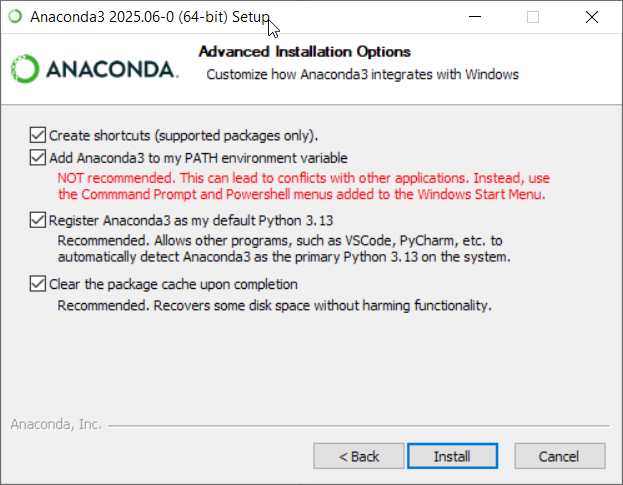

## Course Software

Please install the following software as soon as possible:

### 1. [Anaconda](https://www.anaconda.com/download/success)

Anaconda comes with Python, Jupyter Notebook, and commonly used data analysis libraries pre-installed, so you don't need to install them manually.

**Windows installation:** On the **Advanced installation options** page, check **all** boxes including:

- ✅ *Add Anaconda3 to my PATH environment variable*  
- ✅ *Register Anaconda3 as my default Python*
- ✅ *Clear the package cache upon completion*


This will allow you to run `python`, `ipython`, and `jupyter` directly from Command Prompt(CMD), PowerShell, or VS Code.

---

### 2. [Visual Studio Code](https://code.visualstudio.com/)

We will use VS Code for **both Python scripts** and **Jupyter Notebooks**.

After installing VS Code, install these extensions:

- **Python**
- **Jupyter**
- **Pylance**

When opening a `.py` or `.ipynb` file:

1. Press `Ctrl+Shift+P` → **Python: Select Interpreter** → choose Anaconda's `base` environment.  
2. In a Notebook, click **Select Kernel** (top-right) and choose the same interpreter.

---

### 3. [Git](https://git-scm.com/) (command line) **and** [GitHub Desktop](https://desktop.github.com/)

Install **both** so you can use Git from VS Code's integrated terminal **and** have a visual interface for commits and syncing.

Before installing: Sign up for a GitHub account using your school-affiliated email address so you can access student benefits and course repositories.

**Windows:** Install [Git for Windows](https://git-scm.com/download/win) (default options are fine; it includes Git Bash and the `git` command).  
**macOS:** Git is often pre-installed. If not, run:
```bash
xcode-select --install
```
or download from [git-scm.com](https://git-scm.com).

After installing, log into GitHub in VS Code to clone course repositories and submit assignments.

---

### Quick Checks

Run these in your terminal (CMD/PowerShell on Windows, Terminal on macOS). If all commands return a version number, you are ready:
```bash
python --version
ipython --version
git --version
```
